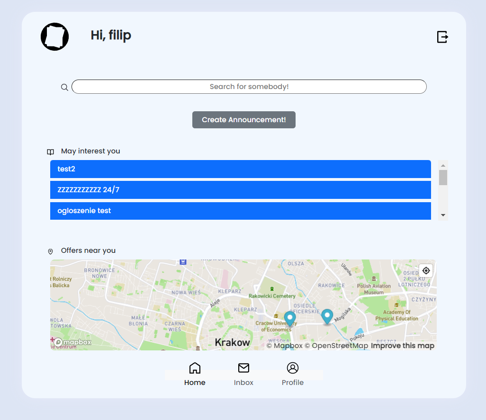

# SideJobHub Web Application

Welcome to SideJobHub! This web application allows users to offer help in side jobs or request to hire somebody for a side job. It also enables users to chat with each other. The application is built using Django, React, PostgreSQL, and Redis.

## Features

- User Registration: Users can create an account to access the platform.
- User Authentication: Secure authentication system is implemented.
- Job Listings: Users can create job listings to offer or request side jobs.
- Chatting: Users can communicate with each other using the chat functionality.
- Real-time Updates: The chat feature is implemented using Django Channels, providing real-time updates.

## Prerequisites

To run the SideJobHub web application, ensure you have the following dependencies installed:

- Docker
- Docker Compose

## Installation and Setup

Please follow the instructions below to set up and run the web application:

1. Clone this repository to your local machine.

2. Open a terminal or command prompt and navigate to the project's root directory.

3. To run the frontend, change to the `frontend` directory using the following command:

`cd frontend`

4. Start the frontend Docker container by running the following command:

`docker-compose up`

This will download the necessary dependencies, build the frontend application, and start the development server. The frontend will be accessible at `http://localhost:3000`.

5. To run the backend, change back to the project's root directory using the following command:

`cd ..`

6. Change to the `sidejobhub` directory using the following command:

`cd sidejobhub`

7. Start the backend Docker containers by running the following command:

`docker-compose up`

This will download the required dependencies, set up the Django backend, PostgreSQL database, and Redis for handling chat functionality.

8. The backend server will be accessible at `http://localhost:8000`.

9. Access the SideJobHub web application by opening your web browser and visiting `http://localhost:3000`.

## Contributing

We welcome contributions to enhance SideJobHub. If you encounter any bugs, have feature requests, or would like to make improvements, please open an issue or submit a pull request.

## License

This project is licensed under the MIT License. Feel free to modify and distribute it as per the terms of the license.

## Acknowledgements

We would like to acknowledge the following technologies and frameworks that have been used to build SideJobHub:

- [Django](https://www.djangoproject.com/)
- [React](https://reactjs.org/)
- [PostgreSQL](https://www.postgresql.org/)
- [Redis](https://redis.io/)
- [Django Channels](https://channels.readthedocs.io/)

Thank you for using SideJobHub! We hope you find it useful for finding side jobs or hiring individuals for your side projects. If you have any questions or need assistance, please don't hesitate to reach out to us.
